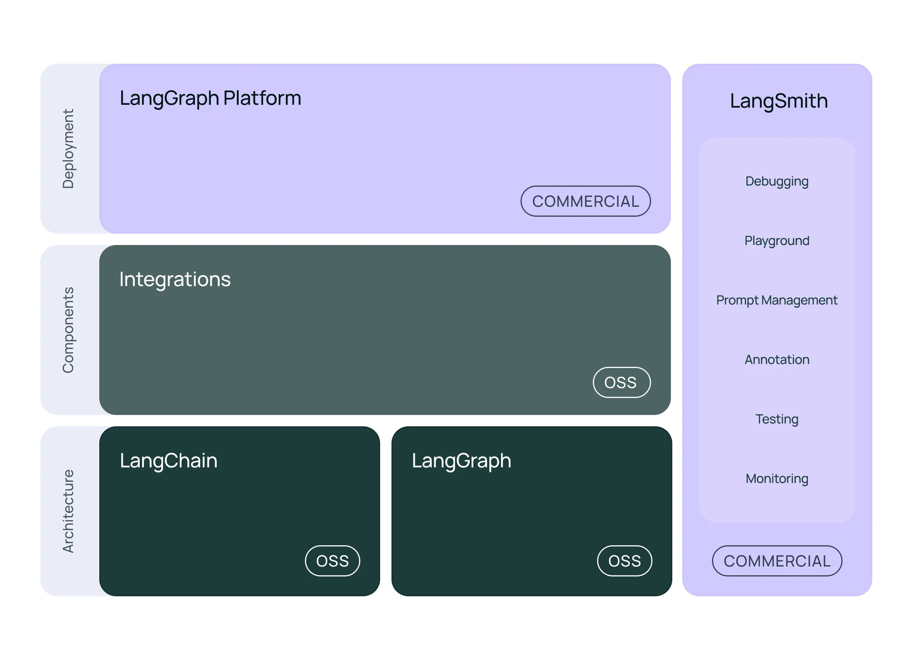

LangChain is a composable framework to build with LLMs. LangGraph is the orchestration framework for controllable agentic workflows.

Deploy your LLM applications at scale with LangGraph Platform, our infrastructure purpose-built for agents.

Debug, collaborate, test, and monitor your LLM app in LangSmith - whether it's built with a LangChain framework or not. 



### LangGraph Platform
Use LangGraph Platform’s APIs to design agent-driven user experiences featuring human-in-the-loop, multi-agent collaboration, conversation history, long-term memory, and time-travel. Deploy with fault-tolerant scalability.

## LangSmith
Ship faster with LangSmith’s debug, test, deploy, and monitoring workflows. Don’t rely on “vibes” – add engineering rigor to your LLM-development workflow, whether you’re building with LangChain or not.

```shell
pip install langchain
python src/Langchain.py
```

## References 
- [Langchain Web](https://www.langchain.com/)
- [Langchain & Python & oLLama](https://python.langchain.com/docs/integrations/chat/ollama/)