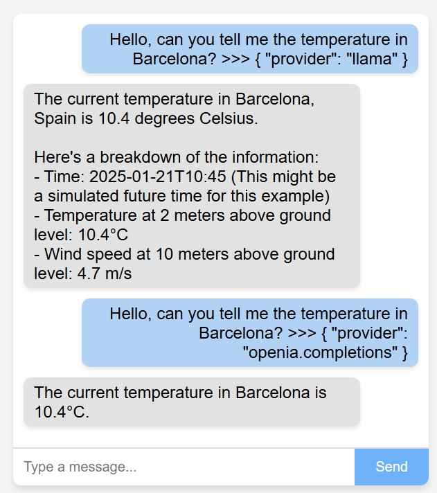

## Assistant Demo App

## Project Structure
```
Project/
├── db/
│   ├── 10000/
│   ├── 10001/
│   │   ├── 5554/
│   │   ├── 5555/
│   │   │   ├── image/
│   │   │   ├── audio/
│   │   │   └── thread.json
│   │   └── profile.json
├── cfg/
│   │   └── config.js
├── src/
│   ├── vendor/
│   │   ├── connectors/
│   │   │   ├── calendar/
│   │   │   │   ├── metadata.json
│   │   │   │   └── index.js
│   │   │   ├── email/
│   │   │   │   ├── metadata.json
│   │   │   │   └── index.js
│   │   │   └── weather/
│   │   │       ├── metadata.json
│   │   │       └── index.js
│   │   └── providers/
│   │   │   ├── llama/
│   │   │   │   ├── metadata.json
│   │   │   │   └── index.js
│   │   │   ├── openia.assistants/
│   │   │   │   ├── metadata.json
│   │   │   │   └── index.js
│   │   │   └── openia.completions/
│   │   │       ├── metadata.json
│   │   │       └── index.js
│   └── modules/
│   │   ├── chat/
│   │   │   ├── controllers/
│   │   │   ├── services/
│   │   │   ├── models/
│   │   │   └── views/
│   │   └── provider/
│   │   │   ├── controllers/
│   │   │   ├── services/
│   │   │   ├── models/
│   │   └── connector/
│   │   │   ├── controllers/
│   │   │   ├── services/
│   │   │   ├── models/
│   ├── common/
│   │   ├── server/
│   │   │   ├── ws.js
│   │   │   └── web.js
│   │   ├── plugin/
│   │   │   ├── connector.js
│   │   │   ├── provider.js
│   │   │   └── plugin.js
│   │   ├── utils/
│   │   │   ├── fetch.api.js
│   │   │   ├── locator.js
│   │   │   └── polyfill.js
│   └── server.js
├── package.json
├── .env
└── README.md
```



### Commands 

Simple profile specification:
```
Hello, can you tell me the temperature in Barcelona? >>> 10001
```

JSON metadata with profile specification:
```
Hello, can you tell me the temperature in Barcelona? >>> { "name": "10001" }
```

Metadatos JSON con especificación de perfil y opciones de sobrescritura de perfil:
```
Hello, can you tell me the temperature in Barcelona? >>> { "name": "10001", "provider": "openia.completions" }
```


## Install & Configure
1. Install Required Libraries:
    - npm init -y
    - npm install openai googleapis nodemailer dotenv axios ws

2. Setup Environment Variables: 
    ```
    OPENAI_API_KEY=your_openai_api_key
    GOOGLE_CLIENT_ID=your_google_client_id
    GOOGLE_CLIENT_SECRET=your_google_client_secret
    GOOGLE_REFRESH_TOKEN=your_google_refresh_token
    EMAIL_USER=your_email@example.com
    EMAIL_PASSWORD=your_email_password
    ```

## Tools 
- [OpenAI Usage](https://platform.openai.com/settings/organization/usage)
    - [Usage](https://platform.openai.com/usage)
- [OpenAI Billing](https://platform.openai.com/settings/organization/billing/overview)
    - [Pricing](https://platform.openai.com/docs/pricing)
    - [Models](https://platform.openai.com/docs/models)
- [OpenAI Assistants](https://platform.openai.com/assistants)

## References 
- Realtime
    - [Capabilities](https://platform.openai.com/docs/guides/realtime-model-capabilities)
- [LM Studio](https://lmstudio.ai/)
    - [Docs](https://lmstudio.ai/docs)
    - [REST API](https://lmstudio.ai/docs/api/rest-api)
    - [lmstudio.js](https://github.com/lmstudio-ai/lmstudio.js)
    - [Runtimes](https://github.com/ggerganov/llama.cpp/tree/master/examples/server)

- [oLlama](https://ollama.com/)
    - [Llama Cookbook: The Official Guide to building with Llama Models](https://github.com/meta-llama/llama-cookbook)

- [OpenAI](https://platform.openai.com/docs)
    - [Function calling](https://platform.openai.com/docs/guides/function-calling?lang=node.js&example=search-knowledge-base)
    - [Embeddings](https://platform.openai.com/docs/guides/embeddings)
    - [Streaming](https://platform.openai.com/docs/api-reference/streaming)
    - [Assistants](https://platform.openai.com/docs/api-reference/assistants)
    - [Threads](https://platform.openai.com/docs/api-reference/threads)
    - [Assistants & Threads Quick Start](https://platform.openai.com/docs/assistants/quickstart)
    - [Completion](https://platform.openai.com/docs/api-reference/chat/create)
    - [Examples](https://github.com/openai/openai-assistants-quickstart/tree/main/app/examples)

- Google
    - [Sign in with app passwords](https://support.google.com/mail/answer/185833?hl=en)
    - [Create & use app passwords](https://myaccount.google.com/apppasswords)

- Tutorials
    - [Build a Real-Time Chatbot with Next.js 15, Vercel AI SDK, and Shadcn UI](https://www.youtube.com/watch?v=_tBTfvQr38M)
    - [Build a Voice-to-Voice AI App with OpenAI API & Twilio in Real Time](https://www.youtube.com/watch?v=GzIXNeaczoc)
    - [19. Use OpenAI Realtime API With Audio Files | Generative AI](https://www.youtube.com/watch?v=AcRoCHPBlgE)
        - [OpenAI Realtime API Exploration](https://github.com/AwaisKamran/openai-realtime-api)